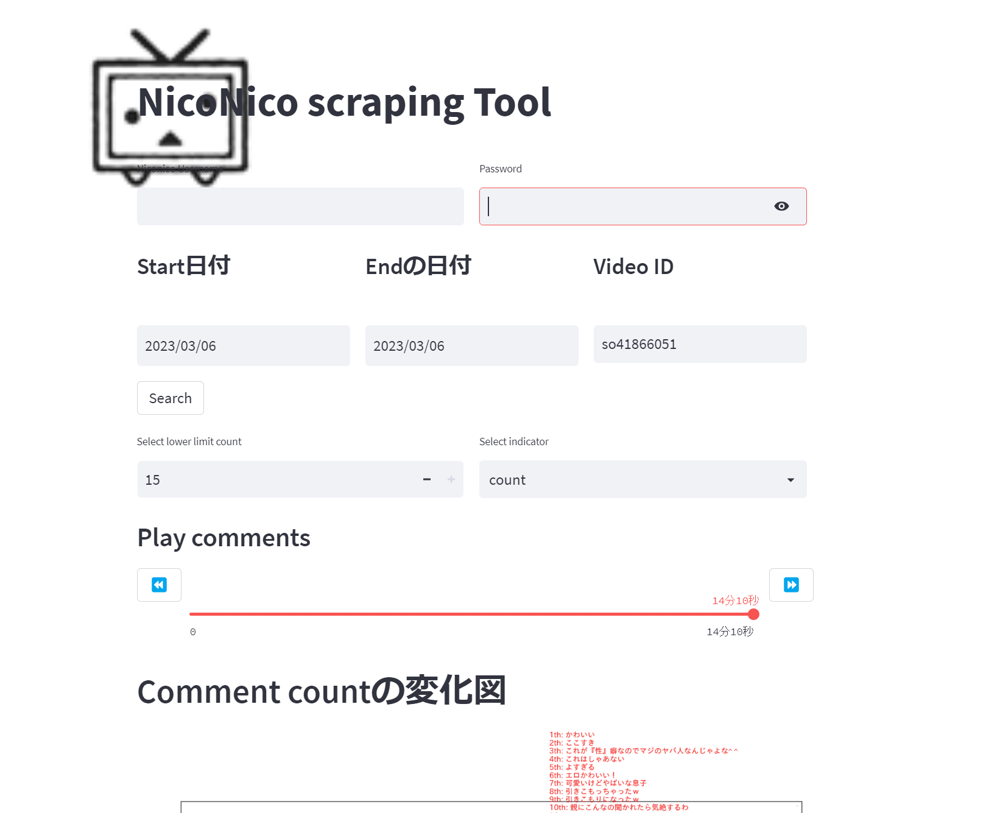

# niconico_scrping_dashboard
 This is a scrping dashboard for Niconico

## How to use.

1. Clone the repo to your working directory
```bash
git clone https://github.com/CodeDiggerM/niconico_scrping_tool.git
```
2. install the dependcy.
```bash
pip install -r requirements.txt
```
3. Run the main page by streamlit.
you can got to [streamlit](https://github.com/streamlit/streamlit) to check more about streamlit.

```bash
streamlit run niconico_scraping.py
````

## UI 
The main UI will be like this
</img>
